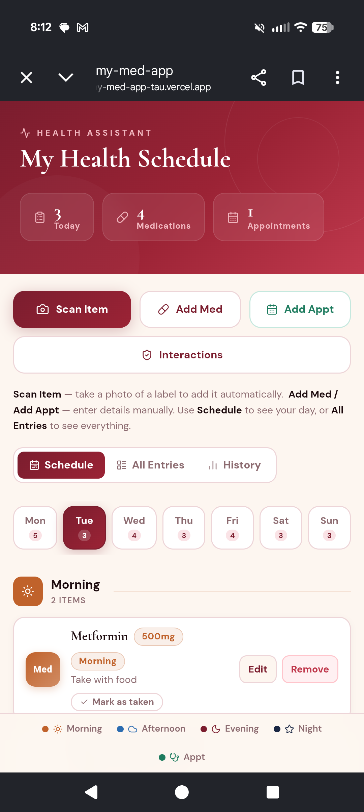
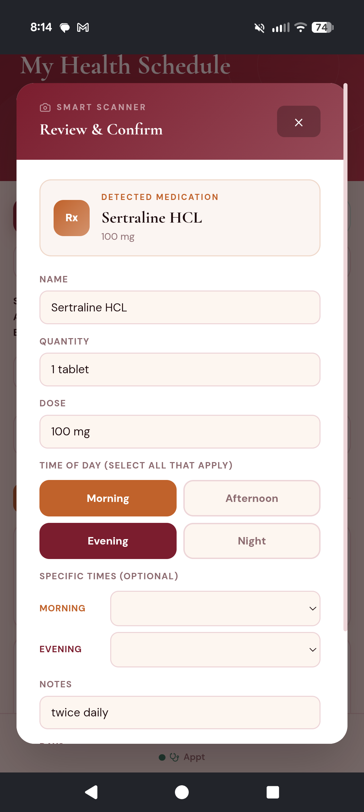
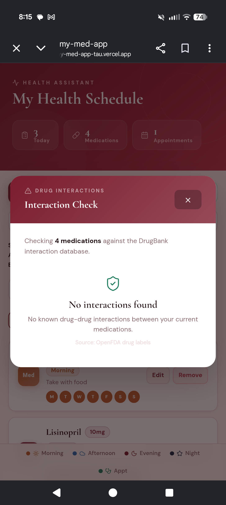
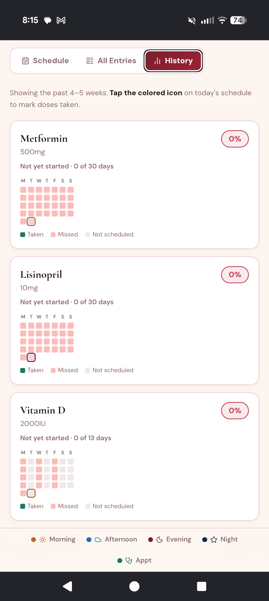

# My Health Schedule
 
AI-powered medication tracker that reads prescription labels with Claude vision, checks drug interactions, and builds your weekly schedule automatically.
 
**[Live Demo](https://my-med-app-tau.vercel.app)**

<p align="center">
  
</p>

## What it does
 
- **Label scanning** — photograph a prescription bottle and Claude's vision AI extracts the drug name, dose, quantity, and instructions automatically
- **Weekly schedule** — medications organized by day and time of day, auto-populated from frequency text like "twice daily" or "three times a week"
- **Dose tracking** — mark doses as taken, feeds into a 5-week adherence history with percentage stats
- **Drug interaction checking** — cross-references your full medication list against drug databases
- **Discontinuation warnings** — flags missed doses for medications with withdrawal risk (SSRIs, benzodiazepines, corticosteroids, etc.)

## How it works

1. User photographs a prescription label in the app
2. The image is sent to a serverless function that calls Anthropic's Claude API (Haiku first, with an Opus fallback for harder labels) to extract structured medication data
3. The extracted name is reconciled against RxNorm to handle brand vs. generic names, and instructions are parsed into a structured schedule
4. Drug interactions are checked server-side against OpenFDA and DrugBank
5. The medication is added to the user's weekly schedule with dose tracking and adherence history

## Screenshots

<p align="center">
  
  
  
</p>

*Left: Claude vision extracts Sertraline HCL 100mg from a photo and pre-fills the form. Middle: real-time interaction check against DrugBank. Right: 5-week adherence history per medication.*

## Tech Stack
 
**Frontend:** React 19, Vite 7, Inline styles with utility patterns, Lucide React, Google Fonts
 
**Backend:** Vercel Serverless Functions (Node.js, ES modules)
 
**AI:** Anthropic Claude API — Haiku first, falls back to Opus
 
**APIs:** RxNorm, OpenFDA, DrugBank (all called server-side)
 
**Persistence:** localStorage only — no database, no user accounts
 
## Privacy
 
No account required. Data stays on your device except for label scans and interaction lookups.

## Running locally

```bash
npm install
npm run dev
```

You'll need an Anthropic API key in `.env` as `ANTHROPIC_API_KEY` for the label scanner to work.
